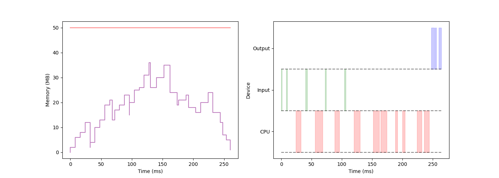

# TinyML Simulator

## Description



This is a simple simulator that simulates neural network behavior in typical TinyML devices. :memo:

More specifically, we assume the underlying device with <u>two levels of hierarchical memory</u>. The <u>slow memory</u> (e.g., Flash) CAN NOT be directly used in computation (we must load them to <u>fast memory</u> first), and it supports <u>full-duplex loading & storing</u>.

Given operators/device specifications and execution plan, the simulator yields detailed memory usage curves and utilization of functional components (illustrated in the above figure) to better evaluate the execution plan.

In the following section, we briefly describe some important classes.

### Operator

There are two kinds of relations between channels, `AllToAll` (e.g., linear) and `OneToOne` (e.g., batch norm).

- Forward phase

  $$
  X^\prime = f(w,X)
  $$

  - All-to-all: `(pred_)output(ch) + param(in_ch) -> output(all)`

  - One-to-one: `(pred_)output(ch) + param(in_ch) -> output(ch)`

  `(pred_)output(ch) -> input(ch)`

- Backward phase

  $$
  \frac{\partial l}{\partial w} = \frac{\partial l}{\partial X^\prime} \times \frac{\partial f}{\partial w}\\
  \frac{\partial l}{\partial X} = \frac{\partial l}{\partial X^\prime} \times \frac{\partial f}{\partial X}
  $$

  - All-to-all

    `(succ_)pass_grad(ch) + input(all) -> grad(ch)`

    `(succ_)pass_grad(ch) + param(out_ch) -> pass_grad(all)`

  - One-to-one

    `(succ_)pass_grad(ch) + input(ch) -> grad(ch)`

    `(succ_)pass_grad(ch) + param(out_ch) -> pass_grad(ch)`

- Optimize phase

  $$
  w^\prime = w- \text{lr} \times \mathrm dw
  $$

```python
class Operator:
    forward_memory_peek: float     # extra memory usage during forward (i.e., DO NOT include input, param, ...)
    forward_time_elapsed: float    # time elapsed during forward
    backward_memory_peek: float    # extra memory usage during backward 
    backward_time_elapsed: float   # time elapsed during backward
    optimize_time_elapsed: float   # time elapsed during optimize

    param_size: float        # size of parameters data
    input_size: float        # size of input data
    output_size: float       # size of output data
    grad_size: float         # size of gradient data
    pass_grad_size: float    # size of passing gradient data

    num_input_channels: int    # number of input channels
    num_output_channels: int   # number of output channels

    pred_ops: List[Operator] = None  # predecessor operators
    succ_ops: List[Operator] = None  # successor operators

    output_channel_accuracy: List[float] = None  # accuracy loss of each output channel

    param_locations: List[MemoryType] = None        # parameters data
    input_locations: List[MemoryType] = None        # input data 
    output_locations: List[MemoryType] = None       # output data
    grad_locations: List[MemoryType] = None         # gradient data
    pass_grad_locations: List[MemoryType] = None    # passing gradient data
```

### Device

```python
class RunTime:
    memory_limit: float  # fast memory limit
    cross_level_bandwidth_read: float
    cross_level_bandwidth_write: float
    target_accuracy: float  # for pruning

class MemoryType(Enum):
    FAST = 1        # in fast memory
    SLOW = 2        # in slow memory
    NONE = 3        # not initialized
    RUNNING = 5     # occupied by operator
```

### Decision

```python
class DecisionType(Enum):
    LOAD = 1        # load data from slow memory
    STORE = 2       # store data to slow memory
    ALLOCATE = 3    # allocate fast memory
    PURGE = 4       # purge fast memory (NOTE: generated by the simulator)
    FORWARD = 6     # run operator forward
    BACKWARD = 7    # run operator backward
    OPTIMIZE = 8    # optimize the parameters
    PRUNE = 9       # prune along output channels (in backward phase)
    COMMIT = 10     # commit the computation (NOTE: generated by the simulator)
    
class Decision:
    wall_time: float  # when this decision happens
    decision_type: DecisionType

    operator: Operator  # apply to which operator
    # which memory block to load/store/allocate
    memory_block: MemoryBlockType
    channel_ids: List[int]  # apply to which channels

    # NOTE: this is only for commit decision
    #   is this commit the last commit for forward/backward ?
    is_last: bool = False
```


## Getting Started

We provide a simple demo in `src/demo.py`.

The steps for generating this simple execution plan can be summarized as follows:

- In forward phase, for each operator, 

  1. load/allocate input data (dataset is stored in slow memory)

  2. load parameters from slow memory
  3. allocate memory for output data
  4. execute forward

- Optional: prune some channels

- In backward phase, for each operator,

  1. allocate memory for gradient data

  2. allocate memory for passing gradient data

  3. execute backward & optimize for not pruned channels

- Finally, store all parameters to slow memory

